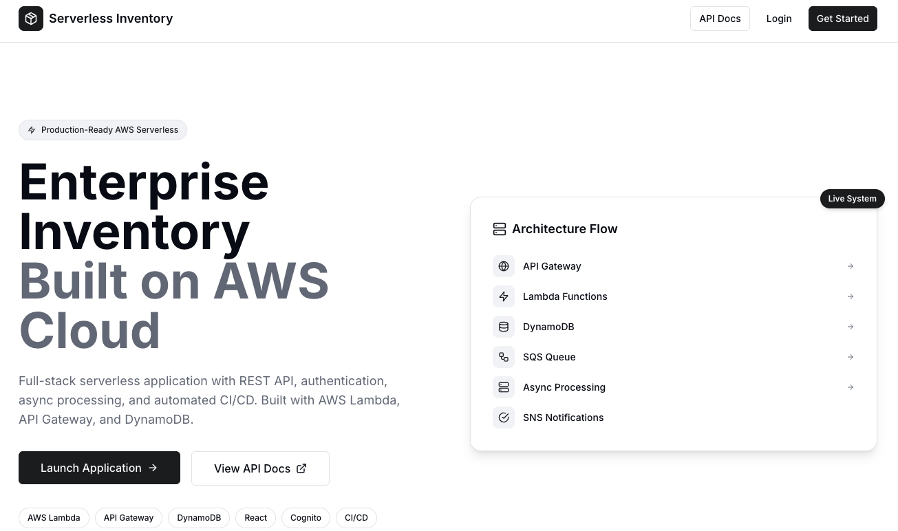
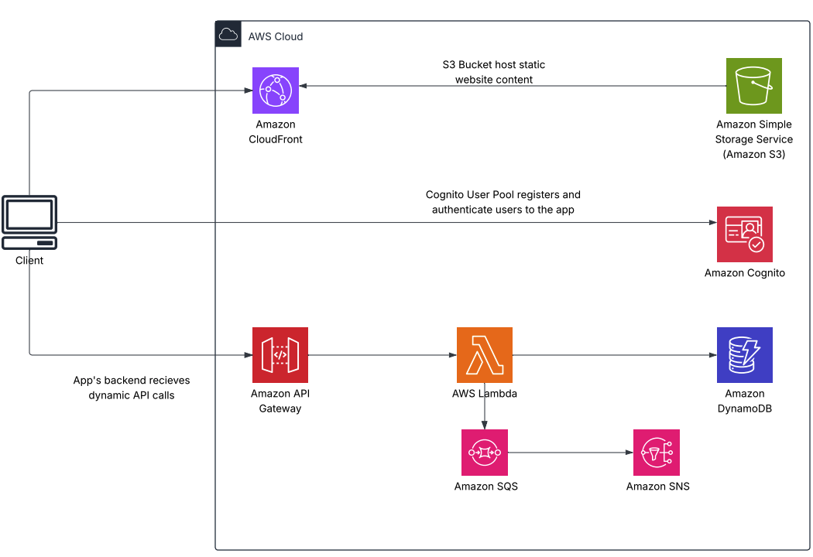
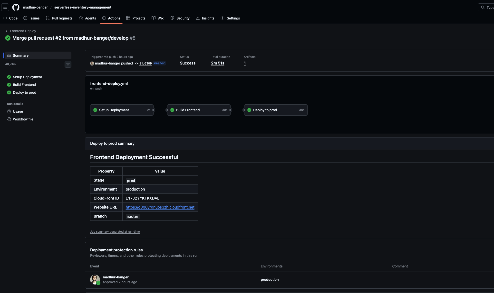
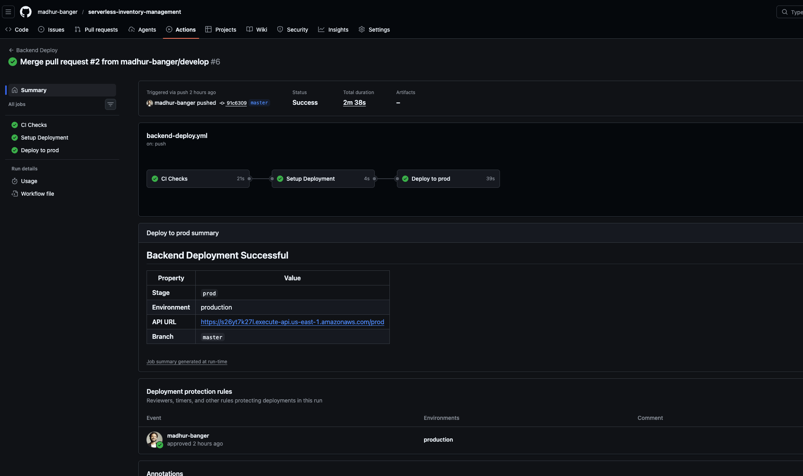
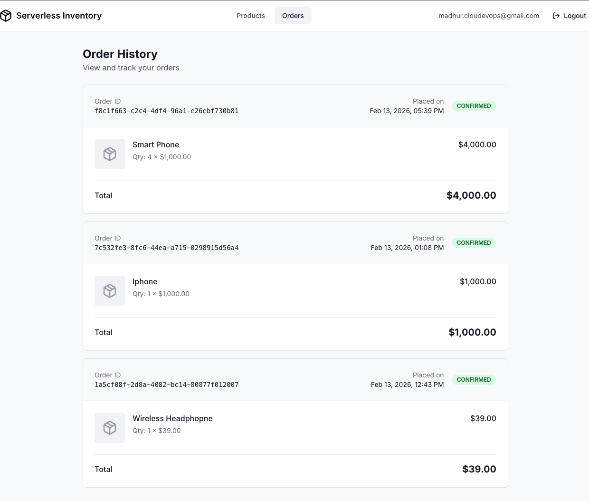

# 🛒 Serverless Inventory Management System

A production-grade, full-stack serverless inventory management system built on AWS, demonstrating enterprise-level architecture, event-driven design, and modern DevOps practices for [sls.guru](https://www.sls.guru/)


## 🌐 [Live Demo]((https://d3g8yrgnuos3zh.cloudfront.net))

| Resource | URL |
|----------|-----|
| **Frontend** | [https://d3g8yrgnuos3zh.cloudfront.net](https://d3g8yrgnuos3zh.cloudfront.net) |
| **API Base URL** | [https://s26yt7k27l.execute-api.us-east-1.amazonaws.com/prod](https://s26yt7k27l.execute-api.us-east-1.amazonaws.com/prod) |
| **API Documentation** | [https://s26yt7k27l.execute-api.us-east-1.amazonaws.com/prod/docs](https://s26yt7k27l.execute-api.us-east-1.amazonaws.com/prod/docs) |





## [Video Walkthrough](https://www.loom.com/share/823b20b6ea7c4872b9091f554a6a34fe)

##  [CI/CD Pipeline Image](#-cicd-pipeline)

## 📋 Requirements Checklist

###  Mandatory Requirements

| # | Requirement | Status | Evidence |
|---|-------------|--------|----------|
| 1 | **JavaScript/TypeScript** - Backend in Node.js, Frontend in React |  Complete | Backend: `backend/src/**/*.ts`, Frontend: `frontend/src/**/*.tsx` |
| 2 | **Infrastructure as Code** - Serverless Framework |  Complete | `backend/serverless.yml` + `backend/resources/*.yml` |
| 3 | **API Gateway + DynamoDB** |  Complete | REST API storing data in DynamoDB single-table design |
| 4 | **Lambda CRUD Functions** |  Complete | 13 Lambda functions |
| 5 | **CI/CD Multi-Stage Deployment** |  Complete | GitHub Actions with stage logic (see [CI/CD Pipeline](#-cicd-pipeline)) |
| 6 | **Fully Working & Documented** | Complete | This README + Technical Documentation + Swagger API Docs |
| 7 | **Public GitHub Repository** |  Complete | [Repository Link](https://github.com/madhur-banger/serverless-inventory-management)  |
| 8 | **Loom Video Walkthrough** | 📹 Complete | *[ [Video Walkthrough](https://www.loom.com/share/823b20b6ea7c4872b9091f554a6a34fe)]* |

### ✅ Optional Enhancements (All Implemented!)

| # | Enhancement | Status | Details |
|---|-------------|--------|---------|
| 1 | **Specific Business Case** |  Complete | E-commerce Inventory Management with Orders & Notifications |
| 2 | **Lambda Packaging** |  Complete | Individual packaging with tree-shaking, Middy middleware |
| 3 | **YAML Organization** |  Complete | Modular resources: `resources/dynamodb.yml`, `resources/cognito.yml`, etc. |
| 4 | **Deployment Scripts** |  Complete | `npm run deploy:dev`, `npm run deploy:prod`, test scripts |
| 5 | **Testing Suite** |  Complete | Unit tests (Jest), Integration tests, E2E test scripts |
| 6 | **AWS Cognito Authentication** |  Complete | Full signup/login flow, JWT protected routes |

---

## 🏗️ Architecture Overview

```
┌─────────────────────────────────────────────────────────────────────────┐
│                              CLIENT LAYER                                │
│  ┌────────────────────────────────────────────────────────────────────┐ │
│  │  React SPA (TypeScript + Vite + Tailwind CSS)                      │ │
│  │  • Product Browsing & Search                                        │ │
│  │  • Order Management                                                 │ │
│  │  • User Authentication (Cognito)                                    │ │
│  └────────────────────────────────────────────────────────────────────┘ │
│                                    │                                     │
│                                    ▼                                     │
│  ┌────────────────────────────────────────────────────────────────────┐ │
│  │  Amazon CloudFront CDN  →  Amazon S3 (Static Hosting)              │ │
│  └────────────────────────────────────────────────────────────────────┘ │
└─────────────────────────────────────────────────────────────────────────┘
                                     │
                                     ▼
┌─────────────────────────────────────────────────────────────────────────┐
│                              API LAYER                                   │
│  ┌────────────────────────────────────────────────────────────────────┐ │
│  │  Amazon API Gateway (REST API)                                      │ │
│  │  • Cognito JWT Authorizer                                           │ │
│  │  • Request Validation                                               │ │
│  │  • Rate Limiting & CORS                                             │ │
│  └────────────────────────────────────────────────────────────────────┘ │
└─────────────────────────────────────────────────────────────────────────┘
                                     │
                                     ▼
┌─────────────────────────────────────────────────────────────────────────┐
│                           COMPUTE LAYER                                  │
│  ┌──────────────┐  ┌──────────────┐  ┌──────────────┐  ┌─────────────┐ │
│  │ Product CRUD │  │  Order CRUD  │  │  Notification │  │    Health   │ │
│  │  (5 Lambdas) │  │  (3 Lambdas) │  │   Processor   │  │    Check    │ │
│  └──────────────┘  └──────────────┘  └──────────────┘  └─────────────┘ │
│                                     │                                    │
│                    ┌────────────────┴────────────────┐                  │
│                    │       Middy Middleware          │                  │
│                    │  • Error Handling • CORS        │                  │
│                    │  • JSON Parsing • Logging       │                  │
│                    └─────────────────────────────────┘                  │
└─────────────────────────────────────────────────────────────────────────┘
                                     │
                                     ▼
┌─────────────────────────────────────────────────────────────────────────┐
│                         DATA & MESSAGING LAYER                           │
│  ┌──────────────┐  ┌──────────────┐  ┌──────────────┐                  │
│  │   DynamoDB   │  │  Amazon SQS  │  │  Amazon SNS  │                  │
│  │  Single-Table │  │ Order Queue  │  │ Email Topic  │                  │
│  │    Design    │  │  + DLQ       │  │              │                  │
│  └──────────────┘  └──────────────┘  └──────────────┘                  │
└─────────────────────────────────────────────────────────────────────────┘
                                     │
                                     ▼
┌─────────────────────────────────────────────────────────────────────────┐
│                     AUTHENTICATION & MONITORING                          │
│  ┌──────────────────────────┐  ┌──────────────────────────────────────┐ │
│  │  Amazon Cognito          │  │  Amazon CloudWatch                   │ │
│  │  • User Pool             │  │  • Lambda Logs & Metrics             │ │
│  │  • JWT Tokens            │  │  • API Gateway Logs                  │ │
│  │  • Email Verification    │  │  • SQS/DynamoDB Metrics              │ │
│  └──────────────────────────┘  └──────────────────────────────────────┘ │
└─────────────────────────────────────────────────────────────────────────┘
```

---

## ⚙️ Lambda Functions

| # | Function Name | HTTP Method | Endpoint | Description |
|---|---------------|-------------|----------|-------------|
| 1 | `health` | GET | `/health` | Service health check (public) |
| 2 | `getDocs` | GET | `/docs` | Swagger UI documentation (public) |
| 3 | `getDocsSpec` | GET | `/docs/spec` | OpenAPI 3.0 specification (public) |
| 4 | `createProduct` | POST | `/products` | Create new product |
| 5 | `getProduct` | GET | `/products/{id}` | Get product by ID |
| 6 | `listProducts` | GET | `/products` | List/search products |
| 7 | `updateProduct` | PUT | `/products/{id}` | Update product |
| 8 | `deleteProduct` | DELETE | `/products/{id}` | Delete product |
| 9 | `createOrder` | POST | `/orders` | Create order (purchase) |
| 10 | `getOrder` | GET | `/orders/{id}` | Get order by ID |
| 11 | `listOrders` | GET | `/orders` | List user's orders |
| 12 | `processOrderNotification` | SQS Trigger | - | Process order notifications |
| 13 | `processOrderDLQ` | SQS Trigger | - | Handle failed notifications |


---

## 🛠️ Tech Stack

### Backend
| Technology | Version | Purpose |
|------------|---------|---------|
| Node.js | 20.x | Runtime |
| TypeScript | 5.3+ | Type-safe development |
| Serverless Framework | 3.x | Infrastructure as Code |
| AWS Lambda | - | Serverless compute |
| API Gateway | REST | API management |
| DynamoDB | - | NoSQL database |
| Amazon SQS | - | Message queuing |
| Amazon SNS | - | Email notifications |
| Amazon Cognito | - | Authentication |
| Zod | 3.x | Runtime validation |
| Middy | 5.x | Lambda middleware |
| Jest | 29.x | Testing |

### Frontend
| Technology | Version | Purpose |
|------------|---------|---------|
| React | 18.x | UI framework |
| TypeScript | 5.x | Type safety |
| Vite | 5.x | Build tool |
| Tailwind CSS | 3.x | Styling |
| React Query | 5.x | Server state |
| React Router | 6.x | Routing |
| AWS Amplify | 6.x | Cognito integration |
| Axios | 1.x | HTTP client |

---

## 📁 Project Structure

```
.
├── backend/
│   ├── src/
│   │   ├── handlers/           # Lambda function handlers
│   │   │   ├── products/       # Product CRUD handlers
│   │   │   ├── orders/         # Order handlers
│   │   │   └── notifications/  # SQS processors
│   │   ├── services/           # Business logic
│   │   ├── repositories/       # Data access layer
│   │   ├── validation/         # Zod schemas
│   │   ├── middleware/         # Middy middleware
│   │   └── utils/              # Utilities (logger, errors, response)
│   ├── resources/              # Modular CloudFormation resources
│   │   ├── dynamodb.yml        # DynamoDB table
│   │   ├── cognito.yml         # User pool & authorizer
│   │   ├── sqs.yml             # Queues
│   │   └── sns.yml             # Topics
│   ├── tests/                  # Test suites
│   │   ├── unit/
│   │   └── integration/
│   ├── serverless.yml          # Main Serverless config
│   ├── package.json
│   └── tsconfig.json
│
├── frontend/
│   ├── src/
│   │   ├── components/         # React components
│   │   ├── pages/              # Page components
│   │   ├── context/            # Auth context
│   │   ├── hooks/              # Custom hooks
│   │   ├── services/           # API services
│   │   └── types/              # TypeScript types
│   ├── serverless.yml          # Frontend deployment
│   ├── package.json
│   └── vite.config.ts
│
├── .github/
│   └── workflows/
│       ├── ci.yml              # Continuous Integration
│       └── cd.yml              # Continuous Deployment
│
├── docs/
│   └── technical-documentation.md
│
└── README.md
```

---

## 🚀 Quick Start

### Prerequisites

- Node.js 18+
- AWS CLI configured with credentials
- npm or yarn

### Backend Setup

```bash
# Clone repository
git clone https://github.com/madhur-banger/serverless-inventory-management
cd serverless-inventory-system

# Install backend dependencies
cd backend
npm install

# Deploy to dev
npm run deploy:dev

# Deploy to production
npm run deploy:prod
```

### Frontend Setup

```bash
# Install frontend dependencies
cd frontend
npm install

# Update environment variables
cp .env.example .env
# Edit .env with your API URL and Cognito details

# Run development server
npm run dev

# Build for production
npm run build

# Deploy to AWS
serverless deploy
```

---

## 🔄 CI/CD Pipeline

The project uses **5 GitHub Actions workflows** for comprehensive CI/CD:

```
.github/workflows/
├── backend-ci.yml        # Backend linting & testing
├── backend-deploy.yml    # Backend deployment to AWS
├── frontend-ci.yml       # Frontend linting & testing
├── frontend-deploy.yml   # Frontend deployment to S3/CloudFront
└── destroy.yml           # Infrastructure teardown
```

### Backend CI/CD (`.github/workflows/backend-deploy.yml`)

**Triggers:** Push to `master` (paths: `backend/**`)

```
┌─────────────┐     ┌─────────────┐     ┌─────────────┐
│   CI Job    │────►│ Setup Job   │────►│ Deploy Job  │
│             │     │             │     │             │
│ • Checkout  │     │ • Determine │     │ • Configure │
│ • Install   │     │   stage     │     │   AWS creds │
│ • Lint      │     │ • Set env   │     │ • Serverless│
│ • Test      │     │             │     │   deploy    │
└─────────────┘     └─────────────┘     └─────────────┘
```

**Pipeline Features:**
- ✅ **Concurrency control** - Prevents parallel deployments
- ✅ **CI gate** - Lint & tests must pass before deploy
- ✅ **npm caching** - Faster builds with dependency caching
- ✅ **Environment secrets** - Secure credential management
- ✅ **Deployment summary** - API URL in GitHub summary

### Frontend CI/CD (`.github/workflows/frontend-deploy.yml`)

**Triggers:** Push to `master` (paths: `frontend/**`)

```
┌─────────────┐     ┌─────────────────────────────────┐
│  Build Job  │────►│          Deploy Job             │
│             │     │                                 │
│ • Install   │     │ • Download artifact             │
│ • Build     │     │ • Serverless deploy             │
│ • Upload    │     │ • CloudFront cache invalidation │
│   artifact  │     │ • Deployment summary            │
└─────────────┘     └─────────────────────────────────┘
```

**Pipeline Features:**
- ✅ **Artifact passing** - Build once, deploy the artifact
- ✅ **CloudFront invalidation** - Automatic cache clearing
- ✅ **Stack output extraction** - Gets distribution ID & URL

### Multi-Stage Deployment

**Current Implementation:**
- `master` branch → `prod` stage

**Stage Configuration Logic:**
```yaml
if [[ "${{ github.ref }}" == "refs/heads/master" ]]; then
  echo "stage=prod"
else
  echo "stage=dev"
fi
```



---

## 📱 Frontend Features

### Pages

| Page | Route | Auth Required | Description |
|------|-------|---------------|-------------|
| Landing | `/` | ❌ | Marketing page with hero & features |
| Login | `/login` | ❌ | User authentication |
| Signup | `/signup` | ❌ | User registration |
| Products | `/products` | ✅ | Product catalog with filters |
| Product Detail | `/products/:id` | ✅ | Product info + order form |
| Orders | `/orders` | ✅ | Order history |

### Responsive Design

The application is fully responsive across all device sizes:

- **Mobile:** 320px - 639px
- **Tablet:** 640px - 1023px  
- **Desktop:** 1024px+





---

## 🔐 Authentication Flow

```
1. User Registration
   └─► Cognito User Pool
       └─► Email Verification
           └─► Account Activated

2. User Login
   └─► Cognito Authentication
       └─► JWT Tokens Returned
           ├─► ID Token (API auth)
           ├─► Access Token
           └─► Refresh Token

3. Protected API Requests
   └─► Authorization: Bearer <ID_TOKEN>
       └─► API Gateway validates with Cognito
           └─► Request processed
```

---

## 📊 Database Design (DynamoDB Single-Table)

### Access Patterns

| Pattern | Operation | Key Condition |
|---------|-----------|---------------|
| Get Product by ID | GetItem | PK=`PRODUCT#<id>`, SK=`METADATA` |
| List Products by Category | Query GSI1 | GSI1PK=`CATEGORY#<cat>` |
| Get Order by ID | GetItem | PK=`ORDER#<id>`, SK=`METADATA` |
| List User Orders | Query GSI1 | GSI1PK=`USER#<userId>` |

---

## 🧪 Testing

```bash
# Run all tests
npm test

# Run with coverage
npm run test:coverage

# Run specific test file
npm test -- productService.test.ts

# Run integration tests
npm run test:integration
```


---

## 📹 [Video Walkthrough](https://www.loom.com/share/823b20b6ea7c4872b9091f554a6a34fe)

[Video Link](https://www.loom.com/share/823b20b6ea7c4872b9091f554a6a34fe)

**Video Contents:**
1. Architecture overview
2. Code walkthrough (Backend)
3. Infrastructure as Code (Serverless)
4. CI/CD pipeline demonstration
5. Frontend features
6. Live demo

---

## 💰 Cost Estimate

For low-medium traffic (~10,000 requests/month):

| Service | Estimated Cost |
|---------|----------------|
| Lambda | ~$0.20 |
| API Gateway | ~$0.04 |
| DynamoDB | ~$0.25 |
| SQS/SNS | Free tier |
| Cognito | Free tier (<50k MAU) |
| CloudFront | ~$0.43 |
| **Total** | **~$1.45/month** |

---

## 📚 Documentation

- [Technical Documentation](docs/technical-documentation.md)
- [API Documentation (Swagger)](https://s26yt7k27l.execute-api.us-east-1.amazonaws.com/prod/docs)
- [OpenAPI Spec](https://s26yt7k27l.execute-api.us-east-1.amazonaws.com/prod/docs/spec)

---


## 👤 Author

**Madhur**

- AWS Community Builder (Serverless)
- AWS Solutions Architect Associate

---

*Built with ❤️ using AWS Serverless*